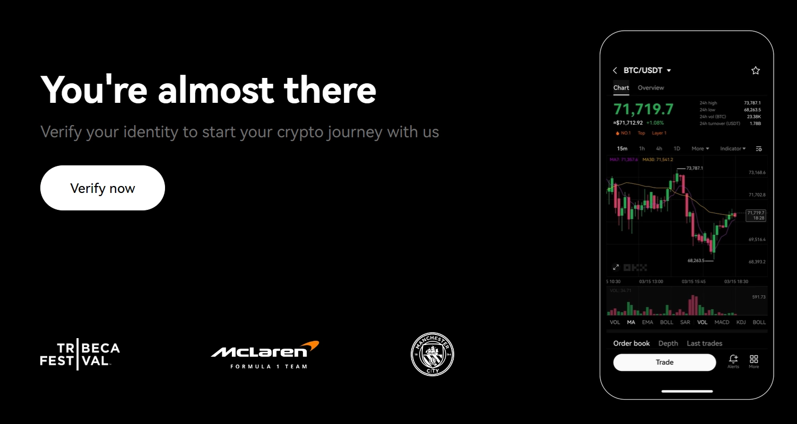
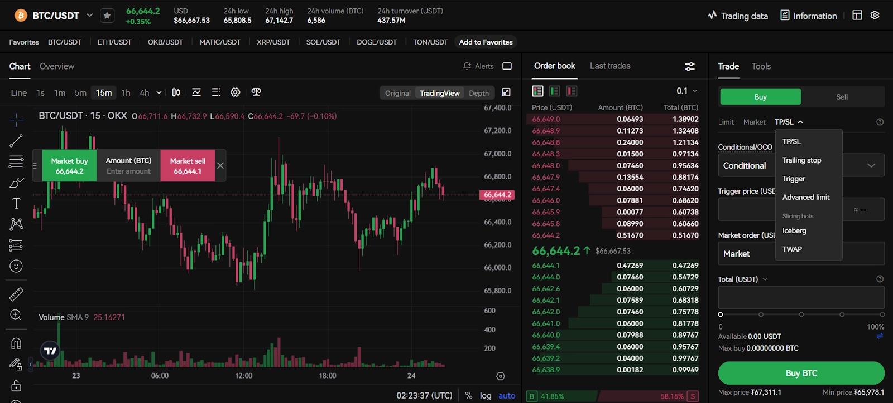
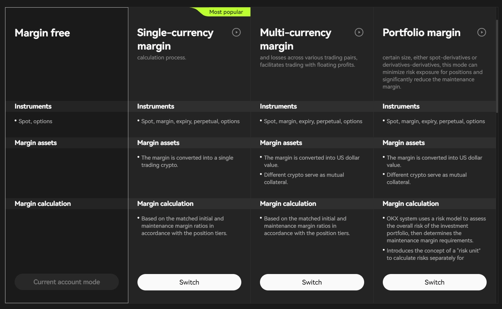
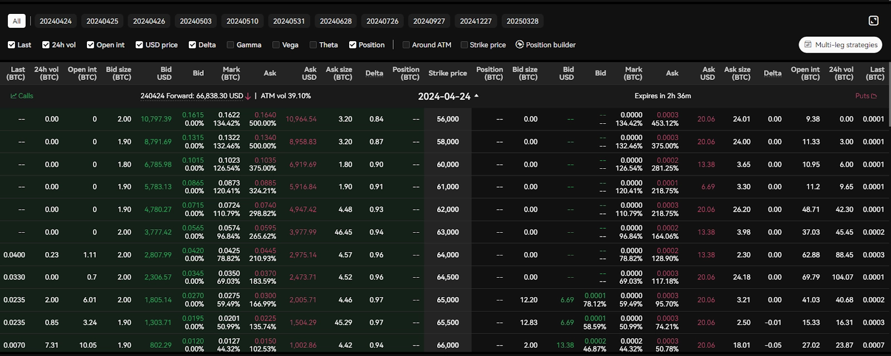
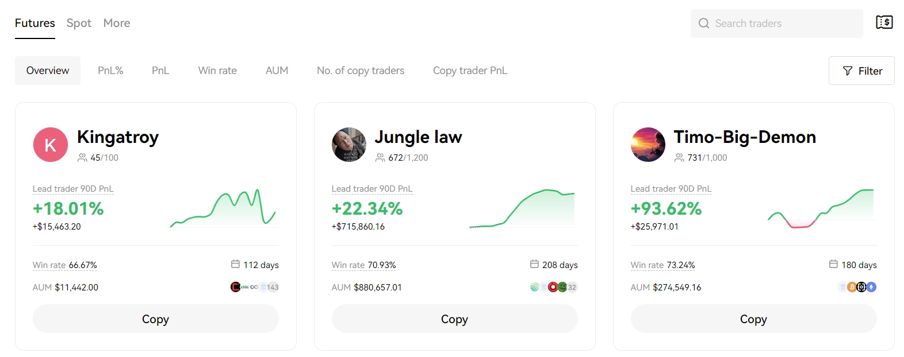
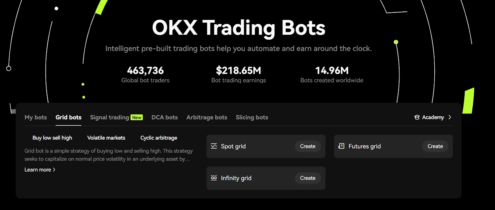
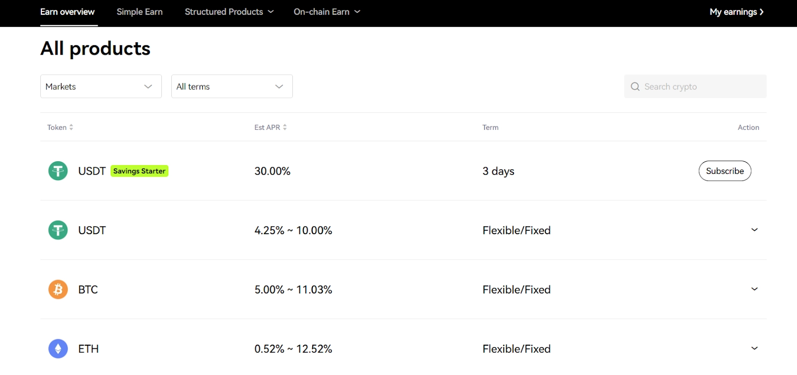
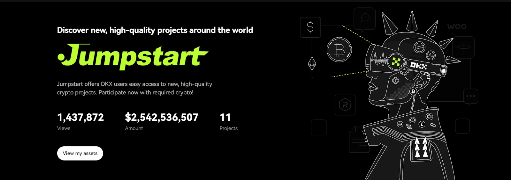
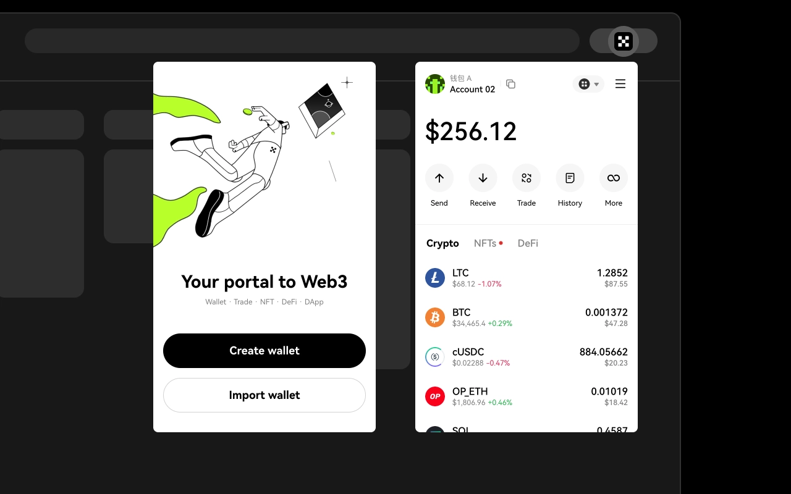
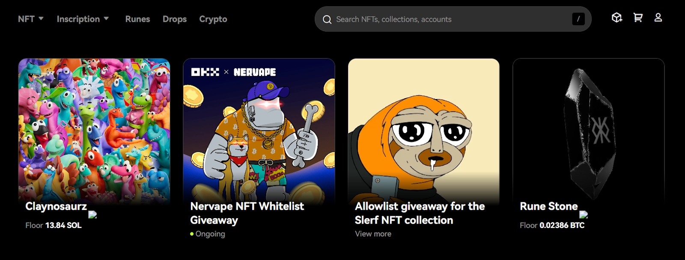

# OKX交易平台全面解析:手续费、安全性与优缺点

根据CMC数据，OKX在全球加密货币交易所中排名第四，无论是交易量还是流动性都表现出色。如果你正在寻找一个支持现货和期货交易、流动性良好的加密货币平台,OKX可能就是你的选择。我们这篇文章会带你了解OKX的方方面面——优缺点、安全措施、手续费,以及它是否真的适合你的交易需求。

---

**核心要点:**

1. OKX是一个可以用欧元、美元等法定货币通过银行账户、信用卡或借记卡买卖比特币、以太坊等数字资产的加密货币交易所。
2. 平台提供现货和衍生品市场、质押服务、跟单交易门户,以及DeFi加密钱包工具(如代币兑换和NFT市场)等全套交易功能。
3. OKX收取少量交易手续费,现货市场做单方0.08%起、吃单方0.1%起,期货做单方0.02%、吃单方0.05%,存款和提款零手续费。

## OKX是什么?(前身OKEx)

OKX,前身是OKEx交易所,是一个以高交易量和深度流动性闻名的全球加密货币交易平台。它由Star Xu于2017年创立,最初叫OKEx,2022年更名为OKX。目前在全球100多个国家都有业务,在阿联酋、香港、新加坡、硅谷和巴哈马等主要中心设有办事处。OKX的交易服务由其在塞舌尔注册成立和巴哈马注册的实体提供。在美国,OKX在硅谷设有办公室,提供Web3服务,但不在美国提供中心化交易所服务。

这个交易所支持超过327种数字资产和533个交易对,包括比特币(BTC)、以太坊(ETH)、狗狗币(DOGE)、泰达币(USDT)等热门选择。你可以用100多种法定货币和全球900多种本地支付方式轻松买卖这些资产。

对于经验丰富的交易者,可以使用OKX的衍生品产品执行高级策略。这些包括传统期货、永续合约和期权合约。它还提供赚取加密货币持有量被动收入的方式,包括质押、储蓄产品和其他收益生成机会(如加密货币贷款)。

关于OKX的Web3门户,它有一个集成的OKX钱包——一个支持70多个区块链网络的非托管多链钱包。它还连接到400多个去中心化应用程序(DApps)和NFT市场,让你可以探索Web3生态系统。

### OKX的优点

* 327+种加密货币和533+个交易对可供选择
* 统一账户模式让你无需在不同钱包间转移资金,就能在现货、保证金和衍生品市场交易
* 提供模拟交易环境,让你用虚拟资金练习策略
* 现货和衍生品市场的交易手续费很有竞争力
* 期货交易最高100倍杠杆,保证金交易最高10倍杠杆
* 为新用户提供"学习"板块,包含加密货币交易教程和市场分析

### OKX的缺点

* 加拿大和美国的加密货币交易者无法使用
* 高级交易工具和DeFi生态系统对初学者来说可能比较复杂

## OKX交易功能评测:核心特色

### 现货交易

现货交易是买卖加密货币最直接的方式。OKX支持超过327种加密货币,可以与USDT(锚定美元的稳定币)、USDC,甚至比特币(BTC)或以太坊(ETH)等其他加密货币配对。它还提供图表工具、技术指标和各种订单类型,进一步简化你的加密货币交易流程。

以下是OKX加密货币交易所现货市场的一些常见订单类型:

* **限价单**: 限价单允许你以设定的确切价格买入或卖出加密货币。只有当市场价格达到你的目标价格时,订单才会执行。这让你对进场或出场点有更大的控制权。
* **止盈/止损(TP/SL)**: 它帮助管理风险。你设定止盈价格(锁定收益)和止损价格(限制损失)。一旦达到任一目标价格,相应的市场单或限价单会自动触发。
* **移动止损**: 这是一种动态止损订单。你不是设定固定价格,而是设定一个移动金额(百分比或货币)。随着资产价格上涨,你的移动止损也会跟随。
* **触发单**: 这个订单会等待你设定的某个价格或条件,然后再下买入或卖出订单(可以是限价单或市价单)。
* **冰山单**: 冰山订单将大额订单拆分成许多小订单,在订单簿中只显示你完整订单的一部分。这有助于在交易大量资产时减少价格滑点。
* **时间加权平均价格(TWAP)**: 它在指定时间内将大额订单拆分成较小的部分执行。目的是实现更接近该时段内平均价格的成交价。

### 期货交易

OKX提供强大的期货交易平台,支持228+种加密货币。在BTC和ETH等热门资产上,你可以使用最高100倍杠杆,而MATIC、ADA、XRP、DOT和SOL等其他币种最高支持50倍杠杆。

平台提供两种主要的期货交易类型:传统期货和永续期货。

* **传统期货**有预定的到期日,到期后必须结算。在这种情况下,随着到期日临近,价格可能会与标的资产的现货价格偏离更多。
* **永续合约**没有到期日。这为交易者提供了更大的灵活性,可以无限期持有仓位。

OKX还提供全仓和逐仓保证金模式。全仓模式使用你所有可用的保证金余额来覆盖所有仓位。逐仓模式限制每个特定仓位使用的保证金。它通过限制一笔交易的损失影响其他未平仓位来帮助降低风险。

与现货市场类似,OKX期货门户配备了一系列工具和订单类型,以适应不同的交易策略。这些包括市价单、限价单、止损限价单和移动止损等高级订单类型。

👉 [想用更低的手续费开启你的加密货币交易之旅?点击这里注册OKX](https://www.okx.com/join/62834398)

OKX提供四种不同类型的期货交易模式:免保证金、单币种保证金、多币种保证金和组合保证金。

* **免保证金**: 不需要预付保证金。未平仓位的利润充当你的抵押品。
* **单币种保证金**: 仅使用一种特定的加密货币作为所有期货仓位的保证金。
* **多币种保证金**: 允许使用你账户中的多种支持的加密货币作为保证金。
* **组合保证金**: 计算你整个投资组合的风险,可能降低保证金要求。

### 保证金交易

保证金交易允许你从OKX借入资金来增加购买力。OKX保证金交易目前在BTC、ETH、OKB、MATIC、SOL和DOGE等热门资产上提供最高10倍杠杆。其他资产仅支持最高5倍杠杆。

要开始保证金交易,首先需要有一些自己的资金作为抵押品。这作为你从交易所贷款的担保。

还有一个关键概念叫做"维持保证金"。这是你必须在账户中保持的最低抵押品金额,以保持你的仓位开放。如果市场对你不利,你的抵押品跌破维持保证金,你的仓位将被强制平仓。这意味着你的资产会被卖出以偿还贷款。

### 期权交易

期权合约比现货交易稍微复杂一些。有了期权,你可以灵活地在指定日期(到期日)或之前以设定价格(行权价)买入(看涨期权)或卖出(看跌期权)标的加密货币。重要的是,你有选择权,但没有义务这样做。

OKX期权是欧式期权,意味着你只能在到期时行权,不能提前行权。与一些采用稳定币结算期权的平台不同,OKX以标的加密货币(例如BTC或ETH)结算其期权合约。

### 跟单交易

跟单交易让你自动模仿另一个交易者(称为"带单者")执行的交易。在OKX上,你根据带单者过往表现(盈亏)、交易策略和风险承受能力等因素选择带单者。当他们在现货市场开仓或平仓时,你的账户会执行相同的交易。OKX跟单交易适用于现货和期货市场。

OKX提供了一份带单者列表,包含详细的表现历史、胜率、管理资产、跟随者数量、盈亏百分比等。你也可以设置自己的投资参数,而不是完全复制带单者。它提供灵活的选项,可以设置每笔交易的固定金额或最大总投资金额。

### P2P交易

P2P,即点对点交易,是一种直接与其他用户买卖加密货币的方式。在这里,OKX充当中间人。为了保护P2P用户,平台使用安全的托管系统。这意味着当你发起交易时,涉及的加密货币会被OKX暂时冻结,直到买卖双方都确认交易成功完成。在OKX P2P上,你不需要向平台支付任何交易费用。

该交易所目前在其P2P市场上支持4种加密货币资产(USDT、USDC、BTC和ETH)。OKX还支持100多种法定货币和900多种支付方式,涵盖你当地的电子钱包、银行转账、信用卡/借记卡和直接现金交易。

### 交易机器人

这些OKX机器人可以创建专业的交易策略,全部自动化。你可以使用现有的机器人,也可以用不同策略创建自己的交易机器人。

OKX提供5种不同类型的交易机器人:网格机器人(现货、期货和无限网格)、信号交易、套利、定投和切片机器人。

1. **网格机器人(现货、期货、无限网格)**: 这些机器人像一个买卖订单的阶梯。它们旨在在价格区间内赚取小额利润,在价格下跌时买入,在价格上涨时卖出。
2. **信号交易机器人**: 它们基于第三方信号工作。你可以集成TradingView或创建自己的交易信号。平台上还有一个信号市场。
3. **套利机器人**: 它们寻找不同市场(如现货与期货)之间的微小价格差异,并试图从这些差距中快速获利。
4. **定投(DCA)机器人**: 这些机器人专注于稳定投资。它们定期买入固定金额的你选择的加密货币。这有助于平滑价格波动的影响。它还包括"定期买入"。
5. **切片机器人**: 切片机器人最适合大额交易或订单,如冰山单或TWAP(如上所述)。它们将大额订单拆分成较小的部分,并随时间执行,以帮助获得更好的整体平均买入价格。

### 流动性市场

OKX流动性市场专门为机构交易者和大额加密货币交易者设计。它作为场外交易(OTC)平台运作。这意味着交易在涉及的双方之间直接协商和结算。与传统的开放订单簿交易所相比,这种方法提供了隐私性、定制化和更好的定价。

询价(RFQ)是OKX流动性市场中的另一个强大工具。它本质上是为你想要的交易寻找最佳价格的一种方式。RFQ是你在说:"嘿,我有兴趣买入或卖出特定数量的加密货币,你的最佳报价是多少?"

RFQ被发送给多个做市商(基本上是专业的流动性提供商),他们竞争提供最具竞争力的价格。这个过程可以帮助你找到比在标准交易所获得的更好的交易。

## OKX赚币服务

### 质押

OKX通过质押提供多种方式让你在加密货币持有量上赚取被动收入。"简单赚币"是最简单的入门方式。它提供两个类别:

* **灵活(储蓄)**: 这个选项允许你存入加密货币并以最大灵活性赚取利息。你可以随时提取资金。灵活选项通常提供的利率低于定期质押。
* **固定(质押)**: 在这里,你将加密货币锁定一段时间以获得潜在的更高收益。在此期间,你的资产积极参与保护区块链网络的安全,因此获得更大的奖励。固定质押的利率取决于特定的加密货币和选择的锁定时间。粗略来说,你可以在某些币种上赚取高达100%的年化收益率,甚至更多。

现在,你还有另一个选择——"OKX结构化产品"。这些产品通常将质押与市场预测或策略相结合。

* **双币投资**: 你预测加密货币的价格在某个日期前会上涨还是下跌。如果你的预测正确,你会获得高回报。在这种情况下,你存入单一资产,但以不同的资产获得报酬。
* **海鸥式**: 它设计用于当你认为市场会在一个方向上大幅移动时。通过这个产品,你可以选择看涨BTC或看跌BTC。如果加密货币的价格按你预期的方向大幅移动,你可能会获得更大的利润。
* **雪球**: 这会自动将你的收益重新投入质押池,本质上是复合你的回报。

链上赚币是在OKX上赚取被动收入的另一种方式。这个选项允许直接的链上质押,你可以为权益证明区块链上的交易验证做出贡献。你可以探索"ETH质押"等选项。

### 加密货币贷款

OKX加密货币贷款功能是一种无需出售现有持有量即可借入加密货币的方式。你使用加密货币作为抵押品。这意味着你拿出一些加密货币作为你会偿还贷款的保证。如果你不这样做,OKX可以保留你的抵押品。

该交易所为贷款提供许多资产,如BTC、ETH、USDT、ALGO、APT等。你可以选择根据市场条件每小时变化的灵活利率贷款,或固定利率以获得可预测的成本。灵活贷款没有固定的还款期限,所以你对何时还清有更大的控制权。

OKX的平均小时年化利率约为1%(可能会变化)。这意味着你的利率根据借贷市场每小时变化。OKX如何确定这个利率取决于以下因素:

* **贷款价值比(LTV)**: 你借入多少相对于抵押品价值的比例。更高的LTV通常意味着更高的利息。
* **供需关系**: 有多少贷方和借方活跃会影响利率。

### Jumpstart(启动平台)

OKX Jumpstart就像新区块链项目的启动平台。目前,OKX已在其Launchpad上启动了11个新项目,总共筹集了25.4亿美元。

它有不同的参与方式。有时你可能通过质押你已经拥有的现有加密货币来"挖矿"代币。在其他情况下,你可能需要质押OKB代币(OKX交易所自己的加密货币)才有机会购买新项目的代币。

## OKX去中心化金融(DeFi)生态系统

### OKX钱包

使用OKX钱包,你可以轻松与去中心化应用程序(DApps)交互,在去中心化交易所(DEX)交易,探索NFT市场等等。

它的设计用户友好。你可以轻松地在70多个区块链上发送、接收和存储大量加密货币。钱包还包括用于即时代币兑换的内置DEX。OKX DEX聚合器搜索20多个网络上的400多个DEX和20多个跨链桥,以找到最佳的比特币和加密货币价格。

OKX钱包是非托管的,这意味着你,而且只有你,持有资产的密钥。该钱包可在不同的操作系统上使用。你可以将其用作浏览器扩展程序,或使用适用于Android和iOS设备的专用移动应用程序。而且,为了在平台之间平滑过渡,你可以轻松地将OKX钱包连接到OKX中心化交易所。

### OKT链

OKX链,或OKTC,是建立在Cosmos(ATOM)上的EVM兼容的一层区块链。该区块链也是100%开源的。

OKT链每秒能够处理6,000笔交易,与以太坊的12-15 TPS相比非常高。与一些较旧的区块链(如以太坊)相比,使用OKTC的成本通常很低(0.01美元)。OKX链也有原生代币(OKT)。

### NFT市场

OKX还提供NFT市场。它支持多种类别的NFT——艺术、收藏品、音乐、游戏物品,甚至虚拟土地。该平台不局限于单一区块链。

它支持以太坊、Polygon、Base、Solana、BNB链等多条链上的NFT。这是因为它从所有热门市场(如OpenSea、Blur、LooksRare、X2Y2、MagicEden等)聚合NFT。这为你作为买家和卖家提供了更大的灵活性。

## 我能在OKX上交易哪些加密货币?

目前,OKX支持超过327种加密货币,拥有533多个交易对,这个选择令人印象深刻。你会发现专注于AI、元宇宙、游戏、DeFi、智能合约等领域的币种。

虽然币种数量不错,但对于想要投资非常新的、低市值币种的人来说可能不够。OKX通常专注于上市更老、更成熟的币种。如果你想要那些超新的、风险更高但有机会获得大额利润的币种,像MEXC和Bybit这样的交易所通常比OKX添加它们要快得多。

以下是你会在OKX上找到的一些热门加密货币:

* 比特币(BTC)
* 以太坊(ETH)
* 泰达币(USDT)
* 比特币现金(BCH)
* USD币(USDC)
* Aptos(APT)
* 卡尔达诺(ADA)
* Solana(SOL)
* 狗狗币(DOGE)
* 波卡(DOT)
* Polygon(MATIC)

## OKX手续费评测

### OKX现货交易费用

OKX对大多数现货和衍生品交易使用做市商-吃单者费用模型。这意味着你支付的费用取决于你是在为市场增加流动性(做市商)还是消耗流动性(吃单者)。

它有基于你30天交易量和OKB持有量的分级费用结构。随着交易量或OKB持有量的增加,你将享受更低的交易费用。

首先,让我们看看持有OKB的OKX费用是什么样的:

现在,如果你不持有OKB代币,也可以根据交易量获得交易费返还。以下是概览:

| 等级 | 30天交易量 | 做市商费用 | 吃单者费用 | 提款限额 |
|------|------------|------------|------------|----------|
| VIP 0 | – | 0.08% |
